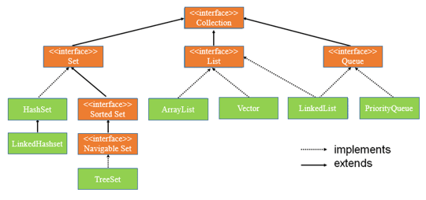
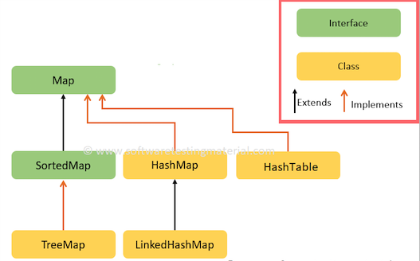

# Col·leccions

## 1. Introducció

Una **col·lecció** és una agrupació d'elements sense mida fixa (dinàmica). Les col·leccions permeten emmagatzemar-hi objectes i realitzar accions com afegir, cercar, recórrer o eliminar elements sense preocupar-nos de la mida, com passa amb els arrays.
L'accés als elements pot fer-se de dues maneres:

* **Per posició**. Els elements es guarden seguint un ordre i per recuperar-los cal indicar-ne la posició.
* **Per clau**. Els elements es guarden sense cap ordre i es recuperen utilitzant una clau.

En Java, les col·leccions es troben al paquet *java.util*.

Les col·leccions d'accés per posició es defineixen a la interfície **Collection** i poden ser de tres tipus: Set, List i Queue. A més, aquestes interfícies disposen de diferents implementacions com HashSet, ArrayList, Vector, LinkedList...

Les col·leccions d'accés per clau es defineixen a la interfície **Map** i poden ser de tipus Map o SortedMap. Algunes de les seves implementacions són HashMap, TreeMap o LinkedHashMap.

## 2. Llistes

Una llista és una col·lecció d'accés per posició que permet emmagatzemar elements repetits. Es tracta d'un array de mida dinàmica on cada element s'identifica per la seva posició. Una llista pot contenir qualsevol tipus d'objecte, però sempre ha de ser del mateix tipus i cal especificar-lo durant la seva creació.

Les llistes es defineixen per la interfície **List**. La classe més utilitzada és **ArrayList**.

Mètodes de la classe ArrayList:

* *boolean add(E element)*. Afegeix un element al final de la llista.
* *boolean add(int index, E element)*. Afegeix un element a la posició especificada i desplaça la resta cap enrera.
* *E set(int index, E element)*. Substitueix l'element indicat per la posició per la nova dada i retorna l'antic.
* *int size()*. Retorna el nombre d'elements de la llista.
* *E get(int index)*. Retorna l'element que es troba a la posició especificada.
* *E remove(int index)*. Elimina l'element especificat de la llista i el retorna.

Per recórrer una llista pot fer-se iterant l'índex amb un *for* o iterant els elements amb un *for each*.

[Exemple d'utilització de llistes](../src/main/java/colleccions/Llistes.java)

[Aplicació de gestió de notes utilitzant la classe ArrayList](../src/main/java/colleccions/notes)

## 3. Taules

Una taula és una col·lecció d'accés per clau que permet emmagatzemar valors repetits.
La informació s'emmagatzema en forma de parelles clau-valor, per tant, els elements no tenen posició ni ordre assignat sinó que s'identifiquen per la seva clau associada.

Les taules es defineixen a la interfície **Map**. La classe més habitual és **HashMap**.

Métodes de la classe HashMap:

* *V put(K clau, V valor)*. Afegeix elements.
* *V get(K clau)*. Recupera el valor per clau.
* *int size()*. Retorna la mida de la taula.
* *V remove(K clau)*. Elimina l'element associat a la clau i retorna el valor.
* *Collection<V> values()*. Retorna una col·lecció amb tots els valors.

Per recórrer una taula cal crear una col·lecció amb tots els valors i recórrer la col·lecció amb un *for each*.

[Exemple d'utilització de taules](../src/main/java/colleccions/Taules.java)

[Aplicació d'agenda de contactes utilitzant la classe HashMap](../src/main/java/colleccions/agenda)

## 4. Conjunts

Conjunt d'elements diferents sense posició, ordre ni clau. No admet valors duplicats.

Els conjunts es defineixen per la interfície **List**. La classe més utilitzada és **HashSet**.

Mètodes de la classe HashSet:

* *boolean add(E element)*. Afegeix un element al conjunt.
* *boolean remove(E element)*. Elimina un element del conjunts.
* *int size()*. Indica la mida del conjunt.
* *boolean contains(E element)*. Retorna un booleà que indica si l'element existeix al conjunt.

Per recórrer un conjunt hem d'utilitzar l'iterador *for each*.

[Exemple d'utilització de conjunts](../src/main/java/colleccions/Conjunts.java)

[Aplicació de gestió de peces utilitzant la classe HashSet](../src/main/java/colleccions/peces)

## 5. Iteradors

[Exemple d'iterador](../src/main/java/colleccions/iterador)

## 6. Recursos

* [Java SE 8. ArrayList](https://docs.oracle.com/javase/8/docs/api/java/util/ArrayList.html)
* [Java SE 8. HashMap](https://docs.oracle.com/javase/8/docs/api/java/util/HashMap.html)
* [Java SE 8. HashSet](https://docs.oracle.com/javase/8/docs/api/java/util/HashSet.html)

