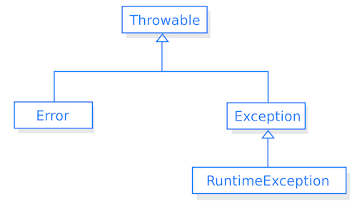

# Excepcions

## 1. Introducció

La gestió d'excepcions és un conjunt de mecanismes que un llenguatge de programació facilita per detectar i gestionar els errors que es puguin produir en temps d'execució.

En Java, quan es produeix un error la màquina virtual llança un avís; aquest situació problemàtica ha de ser prevista pel programador per tal de capturar-la i resoldre-la.

## 2. Errors i excepcions

Un **error** és una situació irrecuperable que provoca la finalització brusca del programa. Els errors no tenen solució ni depenen del programador, no s'han de capturar; per exemple, quan la màquina virtual es queda sense recursos.

Una **excepció** és una situació excepcional que pot produir-se en temps d'execució i que el programador ha de preveure.

Cada possible situació problemàtica té associada una classe derivada de *Throwable*. Quan es produeix un error o una excepció es crea un objecte de les subclasses *Error* o *Exception* que conté informació del problema.

Alguns mètodes disponibles són:

* *Throwable getCause()* - Retorna la causa.
* *String getMessage()* - Retorna el missatge.
* *void printStackTrace()* - Mostra la cascada de crides des de *main()* que han portat al punt en què s'ha produït l'error.
* String toString()* - Retorna una curta descripció de l'objecte.

## 3. Tipus d'excepcions

Les **excepcions implícites** deriven de *RuntimeException* i estan relacionades amb errors de programació. El programador no té l'obligació de capturar-les ni gestionar-les. Per exemple, sobrepassar la longitud d'un array.

Les **excepcions explícites** no pertanyen a la subclasse *RuntimeException* i el programador està obligat a tenir-les en compte. Quan s'utilitza un mètode cal comprovar la documentació per saber quines excepcions pot llençar i gestionar-les.

## 4. Gestió d'excepcions

### 4.1. Captura d'excepcions
El codi susceptible de generar una excepció se situa dins d'un bloc de codi precedit de la paraula reservada **try** i seguit de tants blocs **catch** com excepcions diferents es desitja capturar.

[Exemple de captura d'excepcions](../src/excepcions/Exemple1.java)

També pot afegir-se un bloc **finally** darrera dels blocs catch que s'executarà sempre, després del bloc try (si no hi ha cap excepció) o després de qualsevol dels blocs catch (si hi ha una excepció).

Si existeix un bloc *catch* que capturi l'excepció es passa a aquest bloc, s'executa el bloc *finally* i es continua l'execució del mètode.

Si no hi ha cap bloc *catch* que capturi l'excepció es passa al bloc *finally* i es propaga l'excepció al mètode superior. Si l'excepció arriba al mètode *main()* es produeix un error d'execució i s'atura el programa.

Quan es llença una excepció es comproven els blocs catch per ordre; per tant, cal situar les excepcions més específiques a dalt i les més generals a baix.

Una mateixa sentència *catch* permet capturar diferents tipus d'excepcions separades pel caràcter '|'.

### 4.2. Delegació de la gestió d'excepcions
Si no es desitja gestionar l'excepció dins d'un mètode pot delegar-se aquesta tasca al mètode superior amb la paraula **throws** a la capçalera. En aquest cas, el mètode que l'ha cridat haurà de gestionar aquesta excepció o delegar-la a un mètode superior.

[Exemple de delegació](../src/excepcions/Exemple2.java)

## 5. Creació i llançament d'excepcions

El programador pot crear les seves pròpies excepcions creant una classe que derivi de *Exception* o de qualsevol de les seves subclasses.

[Exemple de creació d'una excepció](../src/excepcions/Problema.java)

Per llençar un excepció cal crear un objecte d'alguna subclasse de *Exception* que es correspongui amb l'excepció que es vol generar i llençarla amb la sentència **throw** seguida de l'objecte.

[Exemple de llançament d'excepció](../src/excepcions/Exemple3.java)

## 6. Recursos

* [Apunts de l'IOC](https://ioc.xtec.cat/materials/FP/Materials/IC_S_INF/INF_IC_S_M03B/web/html/WebContent/u3/a1/continguts.html)
* [Monogràfica Java de l'XTEC](http://www.xtec.cat/monografics/mattic/programacio/java/modul5/m5p4.htm)
* [Curso Java: Excepciones I](https://www.youtube.com/watch?v=QSohwTY04Go)
